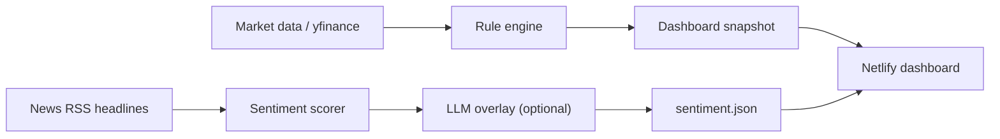

# Local LLM and AI Sentiment Deployment

This project is designed to use local compute first and paid/cloud tokens only as an optional overlay.

The goal is not to let a language model make trades. The model should summarize news, extract risks, explain sentiment, and produce a conditional research posture. The rule engine, price evidence, portfolio limits, and sandbox execution boundary remain the source of truth.

## Current Architecture



By default, the LLM layer is disabled. The deployed site still works using deterministic headline sentiment.

## Environment Variables

Use these variables when running `scripts/export_web_snapshot.py`.

| Variable | Default | Purpose |
| --- | --- | --- |
| `LLM_SENTIMENT_ENABLED` | unset/off | Set to `true` to enable model calls. |
| `LLM_SENTIMENT_PROVIDER` | `ollama` | `ollama` for local Ollama, `openai_compatible` for remote OpenAI-compatible APIs. |
| `LLM_SENTIMENT_MODEL` | unset | Model name, for example `qwen3:8b` for Ollama. |
| `OLLAMA_BASE_URL` | `http://127.0.0.1:11434` | Local or remote Ollama endpoint. |
| `OPENAI_BASE_URL` | `https://api.openai.com/v1` | OpenAI-compatible endpoint for vLLM, llama.cpp server, LiteLLM, or OpenAI. |
| `OPENAI_API_KEY` | unset | Required only for `openai_compatible`. |
| `LLM_SENTIMENT_TIMEOUT_SECONDS` | `45` | Hard timeout for one sentiment call. |
| `LLM_SENTIMENT_CONTEXT_TOKENS` | `4096` | Ollama context window budget. |
| `LLM_SENTIMENT_MAX_TOKENS` | `700` | Maximum generated tokens for the sentiment overlay. |
| `LLM_SENTIMENT_THINK` | `false` | Ollama thinking-mode toggle. Keep false for dashboard snapshots so reasoning models return final summary text quickly. |

## Recommended Local Mac Route

Use this first. It is the simplest and keeps token usage at zero.

1. Install Ollama.
2. Pull a small or mid-size model.
3. Run the snapshot export with LLM variables enabled.

Example:

```bash
ollama pull qwen3:8b

LLM_SENTIMENT_ENABLED=true \
LLM_SENTIMENT_PROVIDER=ollama \
LLM_SENTIMENT_MODEL=qwen3:8b \
python scripts/export_web_snapshot.py --config config.yaml --out-dir web/public/data/us --mode real --lookback-days 900
```

Suggested Mac models:

- `qwen3:8b`: best first choice for Chinese/English mixed market commentary.
- `gemma3:4b`: lighter, faster, lower memory.
- `llama3.1:8b`: solid English market/news summarization.
- `deepseek-r1:8b`: stronger reasoning style, slower, sometimes too verbose.

Guardrails:

- Start with 4B-8B class models.
- Keep `LLM_SENTIMENT_MAX_TOKENS` around `500-700`.
- Keep one LLM call per market snapshot.
- Do not run LLM calls on every page load.

## Windows or Linux NVIDIA Route

This is the likely best future route for a 3090 Ti or 3060 Ti machine.

### Recommended: Self-Hosted GitHub Actions Runner

Use this route when the website should refresh automatically but the LLM should run on your own GPU machine, not inside Netlify or GitHub-hosted runners.

```text
NVIDIA PC
  - GitHub self-hosted runner with the label local-llm
  - Ollama or vLLM
  - scheduled snapshot export with LLM analysis
      |
commit web/public/data/*.json
      |
GitHub Actions deploys the static Netlify site
```

Setup outline:

1. Install the GitHub self-hosted runner on the GPU host and add `windows`, `local-llm`, and optionally `nvidia` labels.
2. Install Python, Node, Git, and Git Bash on Windows hosts.
3. Install Ollama, then pull a model:

```bash
ollama pull qwen3:8b
```

4. Keep Ollama listening locally at `http://127.0.0.1:11434`.
5. Run the `Refresh Web Snapshot Local LLM` workflow manually once from GitHub Actions.

The workflow file is `.github/workflows/refresh-web-snapshot-local-llm.yml`. It runs on `[self-hosted, windows, local-llm]`, checks the model with `scripts/check_local_llm.py`, and enables `LLM_SENTIMENT_ENABLED=true` only when the endpoint and model are ready. If the check fails, snapshot generation still succeeds with the deterministic headline sentiment layer.

For the full Windows-first setup, see `docs/windows_nvidia_local_llm_setup.md`.

Useful local checks:

```bash
python scripts/check_local_llm.py --provider ollama --model qwen3:8b

LLM_SENTIMENT_ENABLED=true \
LLM_SENTIMENT_PROVIDER=ollama \
LLM_SENTIMENT_MODEL=qwen3:8b \
python scripts/export_web_snapshot.py --config config.yaml --out-dir web/public/data/us --mode real --lookback-days 900
```

For a 3090 Ti, `qwen3:8b` is the conservative first model. Try `qwen3:14b` after the full refresh workflow is stable.

### Option A: Ollama on the GPU Host

Run Ollama on the NVIDIA machine and expose it only over a private network such as Tailscale, WireGuard, or SSH tunneling.

On the project machine:

```bash
LLM_SENTIMENT_ENABLED=true \
LLM_SENTIMENT_PROVIDER=ollama \
LLM_SENTIMENT_MODEL=qwen3:14b \
OLLAMA_BASE_URL=http://YOUR_PRIVATE_GPU_HOST:11434 \
python scripts/export_web_snapshot.py --config config.yaml --out-dir web/public/data/us --mode real --lookback-days 900
```

Model sizing:

- 3060 Ti: prefer 4B-8B quantized models.
- 3090 Ti: 8B-14B quantized models should be reasonable; larger models may work depending on quantization and context length.

### Option B: vLLM or llama.cpp OpenAI-Compatible Server

Use this when you want a server-like setup with an OpenAI-compatible API.

The project already supports:

```bash
LLM_SENTIMENT_ENABLED=true \
LLM_SENTIMENT_PROVIDER=openai_compatible \
LLM_SENTIMENT_MODEL=your-model-name \
OPENAI_BASE_URL=http://YOUR_GPU_HOST:8000/v1 \
OPENAI_API_KEY=local-placeholder \
python scripts/export_web_snapshot.py --config config.yaml --out-dir web/public/data/us --mode real --lookback-days 900
```

Recommended when:

- You want multiple agents/tools to share the same GPU server.
- You want OpenAI-compatible `/v1/responses` style routing.
- You may later add LiteLLM as a router across local and cloud providers.

## Cloud Route

Cloud should stay optional.

Use cloud only when:

- Local hardware is unavailable.
- You need a stronger model for a periodic research report.
- You explicitly accept token or compute cost.

Keep the same interface:

```bash
LLM_SENTIMENT_ENABLED=true \
LLM_SENTIMENT_PROVIDER=openai_compatible \
LLM_SENTIMENT_MODEL=your-cloud-model \
OPENAI_API_KEY=... \
OPENAI_BASE_URL=https://api.openai.com/v1 \
python scripts/export_web_snapshot.py --config config.yaml --out-dir web/public/data/us --mode real --lookback-days 900
```

Do not put cloud keys into frontend code. Use GitHub Actions secrets, local shell environment variables, or a private backend.

## Security Notes

- Do not expose Ollama or vLLM directly to the public internet.
- Prefer Tailscale, WireGuard, SSH tunnel, or a private LAN.
- Keep real portfolio config private.
- Keep live brokerage disabled.
- Treat LLM output as research commentary, not trade execution.

## Pickup Checklist For Another Agent

1. Read `README.md`.
2. Read this file.
3. Confirm `LLM_SENTIMENT_ENABLED` is unset before running cost-sensitive jobs.
4. Run local tests:

```bash
.venv/bin/python -m unittest discover -s tests
npm --prefix web run build
```

5. Generate snapshots:

```bash
python scripts/export_web_snapshot.py --config config.yaml --out-dir web/public/data/us --mode real --lookback-days 900
python scripts/export_web_snapshot.py --config example_hk_config.yaml --out-dir web/public/data/hk --mode real --lookback-days 900
cp web/public/data/us/*.json web/public/data/
```

6. Verify `web/public/data/us/sentiment.json` and `web/public/data/hk/sentiment.json`.
7. For local LLM automation, verify `scripts/check_local_llm.py --provider ollama --model qwen3:8b`.
8. Deploy through either `Refresh Web Snapshot` or `Refresh Web Snapshot Local LLM`.

## Future Enhancements

- Add a local vector store for historical news and quarterly filings.
- Add a source reliability score for headlines.
- Add a per-ticker catalyst tracker.
- Add a GPU-host health check page.
- Add a LiteLLM router so one config can switch between Ollama, vLLM, llama.cpp, and cloud APIs.
