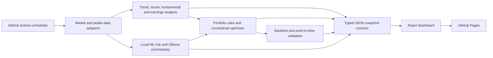

# System Architecture

## Purpose

The project separates market data, deterministic financial rules, machine learning, local LLM commentary, historical validation, and public delivery. The React dashboard contains an interactive version of this map: hovering or selecting a module reveals its inputs, outputs, guardrails, and source files.

The arrow from AI to portfolio rules is constrained. The transparent ML risk model may block or reduce sizing when configured risk thresholds fire. News sentiment and Ollama commentary have zero target-weight authority and cannot create orders.

## Data engineering

| Stage | Primary code | Responsibility |
| --- | --- | --- |
| Configuration | `src/portfolio_agent/config.py` | Validates indicators, risk limits, portfolio inputs, optimization profiles, and data universe. |
| Price adapters | `src/portfolio_agent/data.py` | Fetches adjusted close and OHLC history or loads a local CSV. |
| Public information | `src/portfolio_agent/information_signs.py` | Collects dated Federal Reserve/FRED context and Lance/RIA commentary as information-only signs. |
| Broad screen | `src/portfolio_agent/market_screener.py` | Fetches the eligible liquid US universe and builds momentum, 50/200-day, and entry-posture fields. |
| SEC research | `src/portfolio_agent/sec_fundamentals.py` | Adds sector-aware filings, earnings, quality, value, cash-flow, and financial-strength evidence. |
| Snapshot export | `scripts/export_web_snapshot.py` | Composes dashboard, news, opportunities, validation, health, and history JSON for static hosting. |
| API | `src/portfolio_agent/api.py` | Serves the same analysis contract for local interactive runs. |

## Financial analysis

| Module | Primary code | Decision role |
| --- | --- | --- |
| Indicators | `src/portfolio_agent/indicators.py` | Moving averages, rolling dispersion, and z-scores. |
| Market and sectors | `src/portfolio_agent/signals.py` | Benchmark regime, momentum, drawdown, volatility, and sector extension. |
| DCA and tactical timing | `src/portfolio_agent/market_timing.py` | SPY/QQQ/VTI/VXUS 50/200-day relationships, slopes, RSI, weekly MACD, cross events, and sector breadth. |
| Portfolio rules | `src/portfolio_agent/portfolio.py` | Concentration caps, target gaps, trend filter, stops, cash buffer, and bounded ADD/TRIM/HOLD research actions. |
| Optimizer | `src/portfolio_agent/optimization.py` | Long-only constrained defensive, balanced, and aggressive research allocations. |
| Backtest | `src/portfolio_agent/backtest.py` | Transaction-cost-aware portfolio simulation. |
| Historical validation | `src/portfolio_agent/historical_validation.py` | Next-day-effective walk-forward testing and integrity disclosures. |
| Membership controls | `src/portfolio_agent/point_in_time.py` | Reconstructs historical constituent membership to reduce survivor-list bias. |
| QQQ comparison | `src/portfolio_agent/strategy_comparison.py` | Tests passive QQQ, dynamic allocation, RIA-inspired public proxy, and volatility control. |

The timing layer keeps two decisions separate:

1. `continue_core_dca` means a scheduled long-term contribution is still governed by the investor's written horizon and risk plan.
2. Tactical actions decide whether additional cash is eligible for a staged add, should wait, should not chase an extended trend, or should reduce only the tactical sleeve after a confirmed 200-day break.

This is a public-rule research proxy. It is not RIA's proprietary Money Flow Buy/Sell model.

## AI and machine learning

| Module | Primary code | Authority |
| --- | --- | --- |
| ML risk | `src/portfolio_agent/ml.py` | Estimates forward drawdown-event probability from price-derived features. It may constrain sizing but cannot trade. |
| News sentiment | `src/portfolio_agent/sentiment.py` | Applies a transparent headline lexicon and produces an information posture. News does not change target weights. |
| Research digest | `src/portfolio_agent/research_digest.py` | Bounds private notes and sourced public information before LLM analysis. |
| Local LLM | Ollama, normally `qwen3:14b` | Produces plain-language commentary and research questions. It has zero target-weight authority. |
| Execution boundary | `src/portfolio_agent/execution.py` | Converts suggestions only into sandbox records. Live brokerage is disabled. |

## Frontend and delivery

- `web/src/api.ts` defines the typed browser contract.
- `web/src/main.tsx` composes the dashboard modules.
- `web/src/MarketTimingPanel.tsx` presents DCA and tactical evidence separately.
- `web/src/ArchitectureExplorer.tsx` provides the interactive module and code map.
- `web/src/styles.css` owns responsive desktop, tablet, and mobile behavior.
- `.github/workflows/refresh-web-snapshot-local-llm.yml` runs the local GPU refresh and deploys GitHub Pages.
- `.github/workflows/weekly-historical-validation.yml` refreshes the slower historical study weekly.

The public site contains example portfolio inputs. Real positions, entry prices, credentials, and private research must remain outside the public repository and generated public snapshots.
